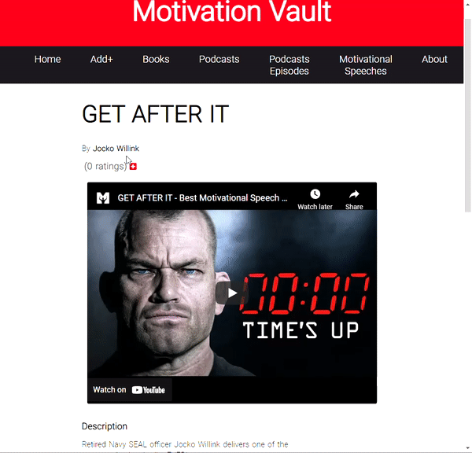

# API Resource

The API Resource is an application that hosts optimistic, inspiring, motivational and educational content.

## Usage

### Adding Resources

You can add a new resource by clicking the "+Add" link on the navigation bar. 

Select the resource type from the dropdown, the resource available resource types are: Book, Podcast, Podcast Episode and Motivational Speech.

Fill in the resource form and click "Add Resource".

**Note:**
*If any required fields aren't filled or the added data is invalid the form will display validation errors.*

After submitting the form your resource will appear first on the home page list and on it's own category list(If resource is a motivational speech it will appear on motivational speeches page).

### Visiting a Resource's Detail Page.
To check more information on a resource, leave a rating or a comment, visit said resource detail page by clicking on the resource's image or text on the home page list or on any category list.

On the detail page the full information of the resource is displayed, including full description and value section, which is basically a list of points on the benefits of consuming said resource.

Also the poster image(for books or podcasts) or embedded youtube video(for podcast episodes or motivational speeches) will be displayed.

### Leave a Rating.
You can leave a rating on a resource by clicking the "+" next to the ratings counter (right below the resource's author) on the detail page.

Here you can click on the number of stars you think the resource deserves and it will inmediatly save that rating.

**Note:** *A user can only leave 1 rating per resource.*

### Leave a Comment.
You can leave a comment by clicking  on the "Write a comment..." input field on the detail page. Once you've written a comment the "Comment" button will become active and clicking it will submit the comment. To abort leaving the comment click "Cancel".

Unlike ratings a user can write as many comments per resource as they like.

 

### Credentials ###   
**TODO!**

 

## Installation - Django

   For installing the Django application clone the repository and run:

     pipenv install

   This will install the virtual environment and all dependencies.
   
   Now start the virtual envrironment shell:
    
     pipenv shell

   Run migrations: 
	
    python manage.py makemigrations resources
    python manage.py migrate

   Create superuser:

    python manage.py createsuperuser
    
   Now you can start server...
   
    python manage.py runserver
   
   ...and visit http://localhost:8000/api/

## Installation - React
For installing the React application go to the front-end folder and run:

    npm install
    
  And after install is finished run:

    npm start

## Running tests

### Unit tests
For running the tests run:

    python manage.py test

### E2E tests
For running the tests run:

    npm run test
For running the tests on headless mode run:

    npm run test:headless
For opening cypress client run:

    npm run test:open
    
## Uses

 - Django.
 - DRF
 - React.
 - Cypress.

## Features
- Token authentication.
- Form validation.
- Ratings.
- Comments.
- End-to-end tests.

