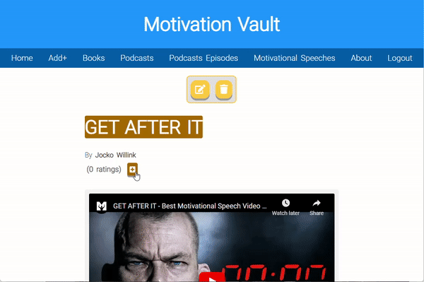

# Motivation Vault

Motivation Vault is an application that hosts optimistic, inspiring, motivational and educational content.

It allows user to create, read, update and delete resource of such content, along with adding comments and ratings to them. The content is in the form of 4 types of 'resources', which can be either books, podcasts, podcast episodes or motivational speech videos.

Each of these resources will contain a title, a description, an image(or video) and a 'learnings' section. The learnings section is a list of points on things learned after consuming said resource. In the case of a book or podcast episode, for example, you can see what was learned after reading the book or listening to the episode.

Users can also leave a rating or add a commnet on each resource, this is achieved through authentication, so that users cannot leave more than 1 rating per resource and so that their names appear on the comments.

  <h2>Desktop</h2>
  
  
  <h2>Mobile</h2>
  

## Usage

### Adding Resources

You can add a new resource by clicking the "+Add" link on the navigation bar.

Select the resource type from the dropdown, the available resource types are: Book, Podcast, Podcast Episode and Motivational Speech.

**Note:** _In case you want to add a Podcast Episode you will need to add a Podcast first, otherwise Podcast Episode won't appear as an option on the dropdown._

Fill in the resource form and click "Add Resource".

**Note:**
_If any required fields aren't filled or the added data is invalid the form will display validation errors._

After submitting the form your resource will appear first on the home page list and on it's own category list (If the resource is a motivational speech it will appear on motivational speeches page).

### Visiting a Resource's Detail Page.

To check more information on a resource, leave a rating or a comment, visit said resource's detail page by clicking on the resource's image or text on the home page list or on any category list.

On the detail page the full information of the resource is displayed, including full description and learnings section, which is basically a list of points on the benefits of consuming said resource.

Also the poster image(for books or podcasts) or embedded youtube video(for podcast episodes or motivational speeches) will be displayed.

On top of each resource's detail page you can find the Edit and Delete resource buttons.
At the moment any user can edit or delete any resource.

### Leave a Rating or Comment.

You can leave a rating on a resource by clicking the "+" next to the ratings counter.

**Note:** _A user can only leave 1 rating per resource._

You can also leave a comment by clicking on the "Write a comment..." input field. Unlike ratings a user can write as many comments per resource as they like.

 

### Credentials

username: testuser1  
password: testpass1

 

## Installation - Django

For installing the Django application clone the repository and run:

     pipenv install

This will install the virtual environment and all dependencies.

Now start the virtual envrironment shell:

     pipenv shell

**Note:** _No need to run migrations as DB already has migrations applied to current data._

Create superuser:

    python manage.py createsuperuser

Now you can start server...

    python manage.py runserver

...and visit http://localhost:8000/api/ to check the browserable API.

Or visit http://localhost:8000/ to check the app.

## Installation - React

For installing the React application go to the front-end folder and run:

    npm install

And after install is finished run:

    npm start

## Installation - Cypress

For installing Cypress go to the e2e folder and run:

    npm install

## Tests

| Type      | Location                                                               |
| --------- | ---------------------------------------------------------------------- |
| api       | [e2e/cypress/integration/api-tests](e2e/cypress/integration/api-tests) |
| ui/visual | [e2e/cypress/integration/ui-tests](e2e/cypress/integration/ui-tests)   |
| unit      | [resources/tests](resources/tests)                                     |

**Note:** _E2E tests involve API, UI and Visual tests. Visual tests are integrated along UI tests flow and will take snapshots at certain points of the flow._

## Running tests

### E2E tests

For running the tests go to the e2e folder and run:

    npm run test

For running the tests on headless mode run:

    npm run test:headless

For opening cypress client run:

    npm run test:open

### Unit tests

For running the tests run:

    python manage.py test

## Uses

- Django.
- DRF.
- React.
- Font Awesome icons.
- Cypress.
- Cypress Image Snapshot.

## Features

- Token authentication.
- Form validation.
- Pagination.
- Rating section.
- Comment setion.
- Unit tests.
- API tests.
- Functional tests.
- Visual tests.
